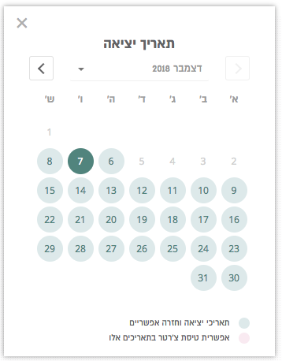
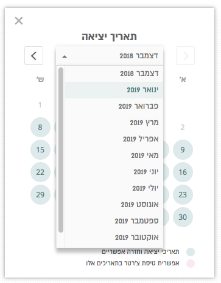

## Datepicker for React js :  LightWeight & Designed & Multi-Lang Ready

### Designed  :

### LIGHTWEIGHT - only 6kb !! (without fonts)
* No usage of CSS frameworks 
* No moment.js needed
* No use of any 3rd party data model
* when clicked, the selected date printed in console as Date() object of JS.
* The calendar allow date selection between today till maxMonths

### More features are:
* Multi Language Ready
* Calendar easily cloned by providing another data model (by React Context)
* Animation effects to: hovers and menu openings 
* Only selectable dates can be clicked 
* Current month passed days are not selectable
* Fonts are included in fonts folder

### Options: 
* Blocked Dats 
<pre>
 blockedDats = [
      { dd: 2, mm: 11, yy: 2019 },
      { dd: 11, mm: 11, yy: 2020 },
      ]
</pre>
* How much ahead you can see/book dates : <pre> maxMonths = 12 </pre>
* First line, and 2nd line guide for the datepicker:  
  in english : guide1_En1  / guide1_En2  
  in other lang :guide1_LangPrefix  // there is an example for 1 more lang  

### Code Example: 
<pre>
< DatepickerContext.Provider
          value={{
            // data
            blockedDats,
            maxMonths,

            // using container state for : 
            selectedDate: this.state.selectedDate, //value
            setSelectedDate: this.state.setSelectedDate, //onChange
            
            // text and display:
            monthDisplayStyle: "long",
            headline: "exit date",
            guideAvailable: guide1,
            guide2
          }}
        >
</pre>

### Fonts
* fonts are included in fonts folder
* Calendar title - Almoni 19px bold
* Dropdown - Almoni 15px
* Day names - Almoni 14px
* Day numbers - Almoni

### `npm start`
Runs the app in the development mode. 
Open [http://localhost:3000](http://localhost:3000) to view it in the browser.