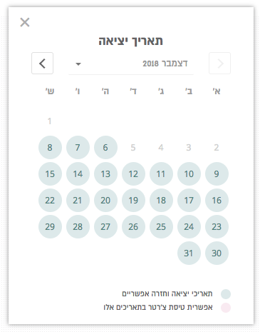

## Datepicker

### Custom designed calendar component according .
* Pictures are at the design folder

### LIGHTWEIGHT
* no usage of CSS frameworks : 
* no use of 3rd party data model

### More features are:
* Calendar easily cloned by providing another data model (by React Context)
* Transition effects to: hovers, menu openings, etc
* when clicked, the selected date printed in console as Date() object of JS.
* Only selectable dates can be clicked 
* Current month passed days are not selectable
* Fonts are included in fonts folder
* The calendar allow date selection between today till maxMonths

### Data to supply: 
* const blockedDats = [
      { dd: 2, mm: 11, yy: 2019 }
      ]
* How much ahead you can see/book dates : maxMonths = 12;
* First line, and 2nd line guide for the datepicker: 
  in english : guide1_En1  / guide1_En2
  in other lang :guide1_LangPrefix  // there is an example for 1 more lang

### Fonts
* fonts are included in fonts folder
* Calendar title - Almoni 19px bold
* Dropdown - Almoni 15px
* Day names - Almoni 14px
* Day numbers - Open Sans 12px

### `npm start`
Runs the app in the development mode. 
Open [http://localhost:3000](http://localhost:3000) to view it in the browser.
